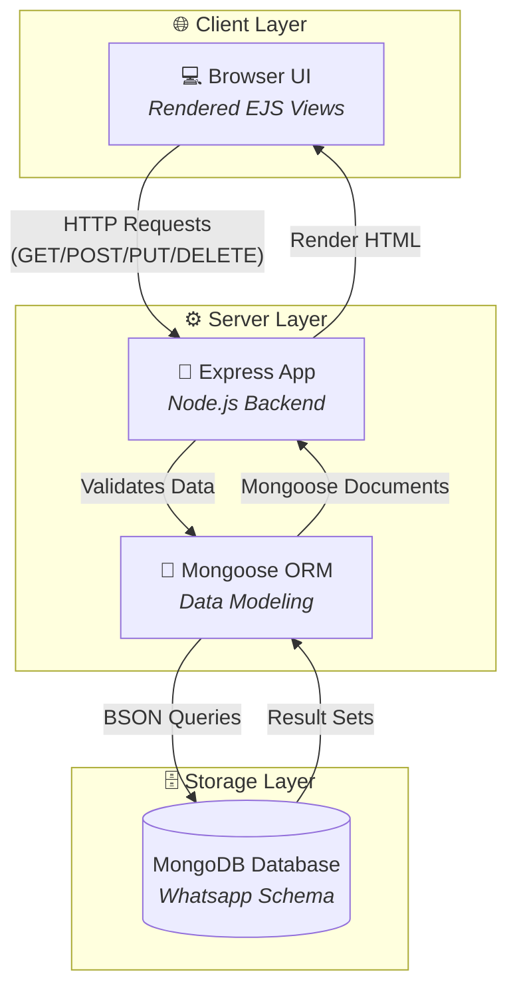
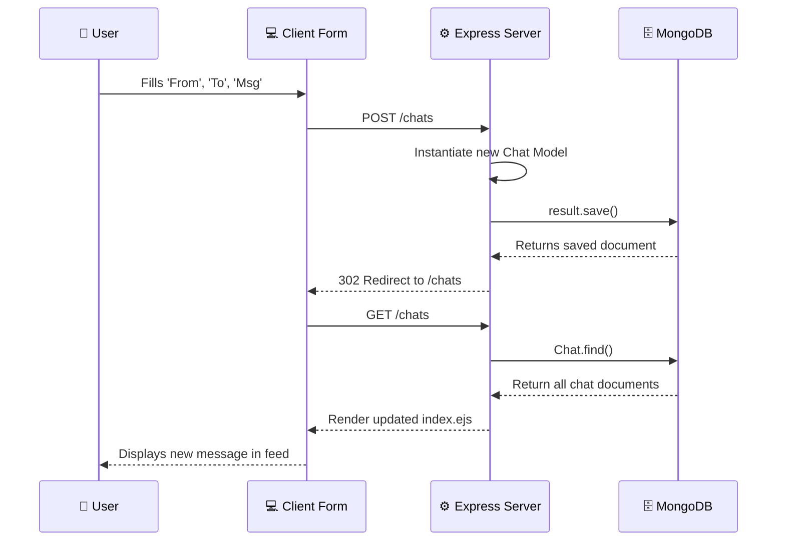

<div align="center">

# 💬 MessageHub

### A server-side rendered Express application for managing WhatsApp-style chat messages via MongoDB.

[](https://nodejs.org/)
[](https://www.mongodb.com/)
[](https://ejs.co/)

</div>

---

## 📌 About

**MessageHub** is a backend-driven web application built to demonstrate core **CRUD** (Create, Read, Update, Delete) functionality using Node.js, Express, and MongoDB. It acts as a rudimentary chat interface where users can view message threads, draft new messages, edit existing content, and delete messages directly from a Mongo database using Mongoose as the ORM.

---

## ✨ Features

- **Global Chat Feed** — View all messages in the database, including the sender, recipient, content, and timestamp.
- **Draft Messages** — Create and send new messages using a dedicated submission form.
- **Edit Content** — Update the text of any previously sent message via a `PUT` request.
- **Delete Messages** — Remove a chat permanently from the MongoDB collection via a `DELETE` request.
- **Mongoose ORM** — Utilizes Mongoose schemas for structured data validation and seamless database interactions.
- **Server-Side Rendering** — Dynamic HTML generation handled entirely by EJS templates.

---

## 🏗️ System Architecture



---

## 🔄 Request Flow (Creating a Message)



---

## 🛠️ Tech Stack

| Layer | Technology | Purpose |
|:---:|:---|:---|
| **Backend** | Node.js, Express.js | Application server and RESTful routing |
| **Database** | MongoDB | Persistent NoSQL document storage |
| **ORM** | Mongoose | Schema validation and DB connection |
| **Templating** | EJS | Server-side HTML generation |
| **Utilities** | `method-override` | Enables PUT and DELETE methods in HTML forms |

---

## 📂 Project Structure

```text
MessageHub-/
├── models/              # Database schema definitions
│   └── chat.js          # Mongoose schema for chat messages
├── public/              # Static assets (CSS, Images)
├── views/               # EJS template files
│   ├── edit.ejs         # Form to edit a message
│   ├── index.ejs        # Main feed displaying all chats
│   └── new.ejs          # Form to create a new message
├── index.js             # Main server logic and route handlers
├── init.js              # Database seeder script
├── package.json         # Node dependencies
└── README.md
```

---

## 🔌 API Routes Reference

| Method | Endpoint | Description |
|:---:|:---|:---|
| `GET` | `/` | Root endpoint connection test |
| `GET` | `/chats` | Retrieve and display all chats |
| `GET` | `/chats/new` | Render form to create a new chat message |
| `POST` | `/chats` | Save a new chat message to MongoDB |
| `GET` | `/chats/:id/edit` | Render form to edit an existing chat |
| `PUT` | `/chats/:id` | Update the content of a specific chat |
| `DELETE`| `/chats/:id` | Remove a specific chat from MongoDB |

---

## 🚀 Getting Started

### Prerequisites
- Node.js (v14+)
- MongoDB Community Server running locally on port `27017`

### 1. Clone and Install
```bash
git clone https://github.com/iZiaur/MessageHub-.git
cd MessageHub-
npm install
```

### 2. Seed the Database (Optional)
Populate the database with initial sample data:
```bash
node init.js
```

### 3. Run the App
```bash
node index.js
```
> The application will listen for requests at `http://localhost:8080`

---

## 📄 License

This project is open source and available under the [ISC License](LICENSE).

---

<div align="center">

**Built with ❤️ by [Ziaur Rahman](https://github.com/iZiaur)**

</div>
